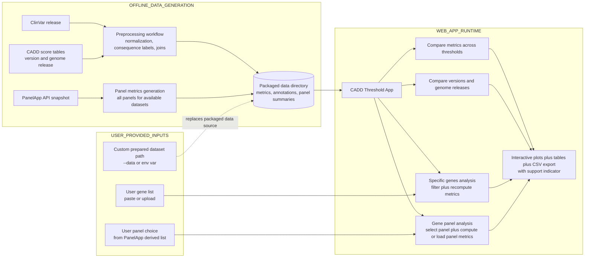

# CADD Threshold App Workflow Diagram

Use this schematic as a manuscript figure to complement UI screenshots.

## Suggested caption (manuscript)

Figure X. End-to-end workflow of the CADD Threshold App. ClinVar and CADD releases are combined in an offline preprocessing workflow that generates the precomputed tables used by the application. PanelApp snapshots are processed in parallel to generate panel-level summaries and metrics. At runtime, users explore precomputed analyses (global threshold and version/genome comparisons) and can run user-driven analyses via custom gene lists or selected PanelApp panels. Optionally, users can provide a custom prepared dataset directory, which replaces the packaged data source. All analysis paths converge in interactive visualizations, tables, exportable summaries, and the support indicator.
